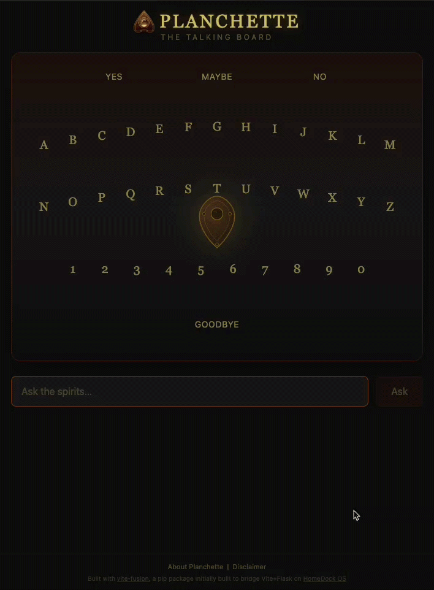

<p align="center"></p>

<h1 align="center">Planchette</h1>
<p align="center"><i>The Talking Board</i></p>

<div align="center">
  
  
</div>

<div align="center">

<a href="https://hub.docker.com/r/bansheetech/planchette">
  
</a>

</div>

---

## About

**Planchette** is an AI-powered spirit board that runs entirely on your machine. Ask a question, and the planchette moves across the board spelling out the spirit's answer. Letter by letter, word by word.

It uses **Ouija-3B**, a 3B parameter language model fine-tuned to behave like a spirit communicating through a talking board. No cloud, no API keys, no internet required after the initial model download.

---

<p align="center"></p>

---

## How It Works

1. You type a question
2. The spirit responds through the board, the planchette glides to each letter
3. The answer appears in the conversation log with a letter-by-letter reveal animation

The board reacts to what the "spirit" says: it may **shake** on a harsh answer, **glow** on a positive one, **flicker** on uncertainty, or **fade away** when the spirit says goodbye.

---

## Features

- Planchette moves across the board spelling answers in real time
- Classic responses: YES, NO, MAYBE, single words, spelled-out names
- Board effects: shake, glow, flicker, fadeout, triggered by the spirit's mood
- Ambient audio with dynamic volume and ghostly sound effects
- Letter-by-letter reveal animations (board and conversation log)
- Typing indicator while the spirit is thinking
- Real-time crisis detection on every message (any language)
- Helpline banner with link to findahelpline.com when distress is detected
- Adaptive context system, adjusts conversation history based on hardware speed
- First-run account setup with bcrypt authentication
- Automatic model download from HuggingFace with progress bar
- GPU acceleration with CPU fallback
- 5-min idle timeout to free memory when not in use
- SSL/HTTPS auto-detection from certificates
- Docker support with persistent config and model storage
- Session export as Markdown
- Responsive design (mobile and desktop)

---

## Crisis Detection

Every message is analyzed before the spirit responds. If signs of emotional distress, self-harm, or suicidal ideation are detected — in any language — Planchette shows a helpline banner linking to [findahelpline.com](https://findahelpline.com) and flags the response in the session export.

Planchette is entertainment. It's not a real spirit. It is not a substitute for professional help.

---

## Disclaimer

> **This is not a real spirit talking board.** Planchette is an AI-powered simulation that uses a language model to generate responses. All answers are artificially generated and do not come from any supernatural or spiritual source. The "spirit" responses are produced entirely by a machine learning model running locally on your device.
>
> Responses may feel meaningful or personal, but they are statistical patterns, not expressions of consciousness, emotion, or any paranormal entity. This application is intended **purely for entertainment purposes**. No claims of paranormal activity are made or implied.

---

## System Architecture

```
Frontend (React + Tailwind CSS)
├── Interactive spirit board with SVG planchette
├── Real-time SSE streaming
├── Adaptive history management
└── Animation system (board effects, letter reveals)

Backend (Python + Flask + Hypercorn — Bridged with vite-fusion)
├── Ouija-3B inference via llama-cpp-python
├── Crisis classification pipeline
├── Adaptive performance system
└── Hypercorn ASGI server with SSL support
```

---

## Installation

### From source

```bash
git clone https://github.com/SurceBeats/Planchette.git
python3 -m venv venv
source venv/bin/activate
pip install -r requirements.txt
python __main__.py
```

Open your browser at `http://localhost:7777` and create your account on first run.

### Docker

```bash
git clone https://github.com/SurceBeats/Planchette.git
docker compose up -d
```

---

## Security Vulnerabilities

If you discover any security vulnerabilities, please contact us at [claudio@banshee.pro](mailto:claudio@banshee.pro).

---

## License

Created by [Claudio Gonzalez](https://github.com/SurceBeats).
Planchette is licensed under the [AGPL-3.0 License](LICENSE).

---

## Changelog

Refer to the full [Changelog](CHANGELOG.md) for details on all updates.
